# 01 — Domain Model

Two categories below: **existing** tables (unchanged — shown for context and to anchor FKs) and **new** tables from `supabase/migrations/20260927000000_career_os_foundations.sql`. Nothing existing is renamed, dropped, or has a column altered; new FKs onto existing tables are additive and nullable.

## ER diagram

```mermaid
erDiagram
  INSTITUTIONS ||--o{ INSTITUTION_MEMBERSHIPS : "has members"
  INSTITUTIONS ||--o{ PROGRAMS : "offers"
  PROGRAMS ||--o{ DEPARTMENTS : "contains"
  DEPARTMENTS ||--o{ COHORTS : "runs"
  COHORTS ||--o{ INSTITUTION_MEMBERSHIPS : "enrolls"
  AUTH_USERS ||--|| PROFILES : "1:1"
  AUTH_USERS ||--o{ INSTITUTION_MEMBERSHIPS : "belongs to"

  AUTH_USERS ||--o{ ASSESSMENT_ATTEMPTS : "attempts"
  ASSESSMENT_ATTEMPTS ||--o{ ASSESSMENT_RESPONSES : "answers"
  AUTH_USERS ||--o{ CAPABILITIES : "has"
  AUTH_USERS ||--o{ CAPABILITY_HISTORY : "accrues"
  AUTH_USERS ||--o{ INTERESTS : "has"
  CAREER_REQUIREMENTS ||--o{ GUIDE_PATHS : "targets"
  AUTH_USERS ||--o{ GUIDE_PATHS : "follows"
  SKILLS ||--o{ CAPABILITIES : "catalogs"

  JOURNEY_TEMPLATES ||--o{ JOURNEY_PHASES : "defines"
  JOURNEY_TEMPLATES ||--o{ STUDENT_JOURNEYS : "instantiates"
  AUTH_USERS ||--|| STUDENT_JOURNEYS : "has one"
  STUDENT_JOURNEYS ||--o{ STUDENT_JOURNEY_EVENTS : "logs"

  AUTH_USERS ||--o{ PLAN_B_EXPLORATIONS : "explores"

  AUTH_USERS ||--o{ PROJECT_MEMBERS : "joins"
  PROJECTS ||--o{ PROJECT_MEMBERS : "has"
  PROJECTS ||--o{ PROJECT_MILESTONES : "has"
  PROJECTS ||--o{ PROJECT_CONTRIBUTIONS : "records"
  AUTH_USERS ||--o{ PROJECT_CONTRIBUTIONS : "makes (individual)"

  AUTH_USERS ||--o{ EVIDENCE : "accrues"
  AUTH_USERS ||--o{ MENTOR_EVALUATIONS : "receives"
  PROJECTS ||--o{ MENTOR_EVALUATIONS : "may reference"

  AUTH_USERS ||--o{ VAULT_ITEMS : "curates"
  AUTH_USERS ||--o{ ARENA_RATINGS : "rated"
  AUTH_USERS ||--o{ ARENA_CHALLENGE_ATTEMPTS : "attempts"

  RECRUITERS ||--o{ OPPORTUNITIES : "posts"
  INSTITUTIONS ||--o{ OPPORTUNITIES : "scopes (optional)"
  OPPORTUNITIES ||--o{ APPLICATIONS : "receives"
  AUTH_USERS ||--o{ APPLICATIONS : "submits"
```

## Existing tables (unchanged, for reference)

| Table | Key columns | Notes |
|---|---|---|
| `profiles` | `id` (=auth.users.id), `email`, `full_name`, `avatar_url`, `primary_role` | `primary_role` already exists (`app_role` enum) — unused by any page/route today |
| `institutions` | `id`, `name`, `slug`, `college_type`, `city`, `state` | `college_type` enum already covers `engineering\|medical\|management\|arts_science\|pharmacy\|law\|other` — multi-vertical B2B2C, ready |
| `institution_memberships` | `user_id`, `institution_id`, `branch`, `year`, `role` (`app_role`), `status` (`pending\|active\|revoked`) | RBAC + approval workflow already schema-real; gains `cohort_id` (new, nullable) |
| `assessment_attempts`, `assessment_responses`, `assessment_section_progress` | — | Assessment engine, unchanged |
| `capabilities` | `user_id`, `skill`, `domain`, `capability_score`, `confidence`, `data_points` | Current-state capability per skill |
| `capability_history` | `user_id`, `skill`, `capability_score`, `confidence`, `source` (`capability_evidence_source`), `recorded_at` | **Is** the brief's `CapabilitySnapshot`/`CapabilityHistory` |
| `career_requirements` | `career_role`, `requirements` (jsonb skill→level) | **Is** the brief's `CareerSkillRequirement`, denormalized. Normalizing to a `career_skill_requirements(career_role, skill_id, required_level)` table is a phase-2 item (`08-roadmap.md`) — not done now to avoid touching every reader of this jsonb shape |
| `interests`, `career_interest_target`, `career_interest_questions` | — | Interest signal, kept separate from capability per the brief |
| `guide_paths` | `user_id`, `target_career`, `is_primary`, `phases` (jsonb), `version`, `generated_at` | Guide Path, already versioned |
| `vault_items` | `user_id`, `item_type`, `title`, `url`, `description` | Manually-curated evidence; distinct from the new `evidence` table (system-derived) |
| `arena_ratings`, `arena_challenge_attempts` | — | ELO + challenge history |
| `question_bank` | — | Assessment/Arena question source |
| `posts`, `post_likes`, `post_comments` | — | Pulse (social feed) — adjacent, not part of the Career OS domain model |

## New tables

### College hierarchy

| Table | PK | FKs | Tenant boundary | Notes |
|---|---|---|---|---|
| `programs` | `id` | `institution_id → institutions` | `institution_id` | e.g. "B.Tech" |
| `departments` | `id` | `program_id → programs` | via `programs.institution_id` | e.g. "CSE" |
| `cohorts` | `id` | `department_id → departments` | via chain to `institutions` | `entry_year_semester`/`graduation_year_semester` — this is what lets CSE-2028 enter at 2-1 while ECE-2028 enters at 2-2, via data not code |
| `institution_memberships.cohort_id` | — | → `cohorts`, nullable | — | Additive column; existing branch/year-string rows are untouched |

### Skills catalog

| Table | PK | Notes |
|---|---|---|
| `skills` | `id` | `name unique`, `domain`. Backfilled from `distinct capabilities.skill` in the migration itself. Reference table only for now — `capabilities.skill` stays free text until phase 2 |

### Journey Engine

| Table | PK | FKs | Notes |
|---|---|---|
| `journey_templates` | `id` | `institution_id → institutions`, nullable | Null institution = platform-default template, usable/overridable by any college — this is what makes "Full Journey" / "Accelerated Journey" / "Career Acceleration Journey" / "Placement Journey" configuration, not code |
| `journey_phases` | `id` | `template_id → journey_templates` | `axis` (`capability\|career` enum) + `key` + `sequence` — the two independent phase lists per template |
| `student_journeys` | `id` | `user_id → auth.users` (unique), `template_id → journey_templates` | One row per student. `current_capability_phase` and `current_career_phase` are independent columns — never derived from academic year |
| `student_journey_events` | `id` | `student_journey_id → student_journeys` | Append-only. The durable side of the domain events in `05-events.md` |

### Plan B

| Table | PK | Notes |
|---|---|---|
| `plan_b_explorations` | `id` | `user_id`, `raw_input`, `extracted_interests`/`career_concepts`/`skill_gaps` (jsonb), `status` (`exploring\|active\|archived`) — first-class, not a text field |

### Project Lab

| Table | PK | FKs | Notes |
|---|---|---|
| `projects` | `id` | `mentor_id`, `created_by → auth.users` | |
| `project_members` | `(project_id, user_id)` composite | both → their tables | Team roster |
| `project_milestones` | `id` | `project_id` | |
| `project_contributions` | `id` | `project_id`, `user_id`, `milestone_id` nullable, `evaluator_id` nullable | **Individual**, not team-aggregated — this is the "team ≠ team capability" rule from §12, enforced structurally: there is no team-level score column anywhere, only per-contribution ones |

### Evidence & Mentor Evaluation

| Table | PK | FKs | Notes |
|---|---|---|
| `evidence` | `id` | `user_id`, `evaluated_by` nullable | `source_type` reuses the existing `capability_evidence_source` enum; `source_id` points at the specific project/arena-attempt/mentor-evaluation row. Complements `capability_history`, doesn't replace it |
| `mentor_evaluations` | `id` | `user_id`, `mentor_id`, `project_id` nullable | |

### Opportunities (Launchpad, first pass)

| Table | PK | FKs | Notes |
|---|---|---|
| `recruiters` | `id` | `user_id` (unique) | Minimal — full recruiter search (§24) is out of scope for this pass |
| `opportunities` | `id` | `institution_id` nullable, `recruiter_id` nullable | Replaces `lib/mock/launchpad.ts` once a real authoring surface exists |
| `applications` | `id` | `opportunity_id`, `user_id` | unique `(opportunity_id, user_id)` |

## Soft-delete & versioning

Nothing above hard-deletes cascades onto a student's own history: `evidence`, `capability_history`, `student_journey_events`, `project_contributions` are append-only by convention (no `deleted_at`, no update policy defined — rows are written once and read many times). `student_journeys` and `plan_b_explorations` carry `updated_at` (trigger-maintained) rather than versioning, since they represent current state, not a ledger. `guide_paths` (existing) is the one entity with explicit `version` — that pattern is worth reusing if `student_journeys` ever needs point-in-time reconstruction; not added preemptively (YAGNI) since nothing reads journey history yet beyond the event log.

## Audit fields

Every new table has `created_at`; tables representing mutable current-state (`programs`, `departments`, `cohorts`, `journey_templates`, `student_journeys`, `plan_b_explorations`, `projects`) also get `updated_at`, maintained by the `set_updated_at()` trigger defined at the end of the migration — the same convention `guide_paths.generated_at`-style manual stamping suggests the project already leans toward, made consistent and automatic here.
